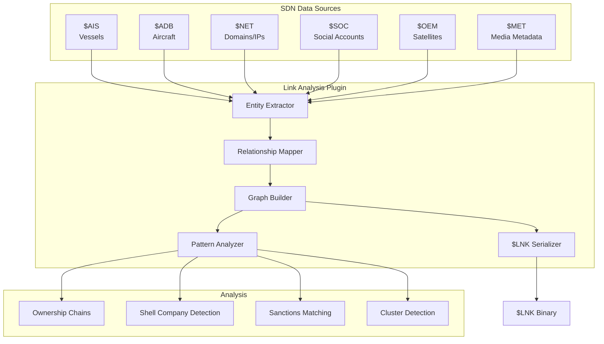
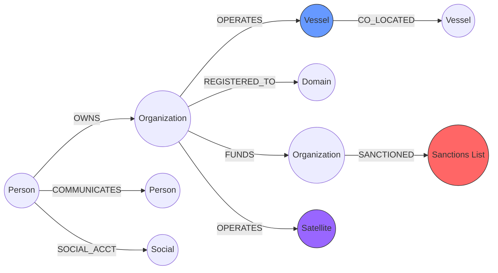

# 🔗 Link Analysis Plugin

[](https://github.com/the-lobsternaut/linkanalysis-sdn-plugin/actions)
[](LICENSE)
[](https://en.cppreference.com/w/cpp/17)
[](https://github.com/the-lobsternaut)

**Entity relationship mapping and network graph analysis — connecting people, organizations, vessels, aircraft, domains, satellites, and financial entities to identify ownership chains, shell companies, sanctions violations, and hidden connections.**

---

## Overview

The Link Analysis plugin builds and analyzes knowledge graphs from data flowing through the Space Data Network. It ingests entity data from multiple SDN plugins and maps relationships between them:

- **13 entity types** — person, organization, vessel ($AIS), aircraft ($ADB), domain ($NET), IP, phone, email, social account ($SOC), location, document, financial, satellite ($OEM)
- **13 relationship types** — owns, operates, funds, communicates, co-located, co-traveled, registered-to, associated, sanctioned, alias, subordinate, transacted
- **Confidence scoring** — 5-level confidence from unverified to confirmed
- **Cross-domain correlation** — links maritime, aviation, cyber, social, and space data into a unified graph

### Why It Matters

Intelligence analysis is fundamentally about connecting dots across domains. A vessel flagged in $AIS, an aircraft tracked in $ADB, a domain from $NET, and a social account from $SOC may all connect to the same sanctioned entity. This plugin makes those connections explicit and queryable.

---

## Architecture



### Graph Model



---

## Data Sources & APIs

| Source Plugin | Entity Types | Relationship Discovery |
|--------------|-------------|----------------------|
| `$AIS` (AIS) | Vessel, Organization | MMSI→flag, ship-to-ship transfers |
| `$ADB` (ADS-B) | Aircraft, Organization | ICAO→operator, co-routing |
| `$NET` (NetRecon) | Domain, IP, Organization | WHOIS, DNS, hosting |
| `$SOC` (SOCMINT) | Person, Social Account | Followers, mentions, groups |
| `$OEM` (Orbits) | Satellite, Organization | Operator, constellation affiliation |
| `$MET` (MediaMeta) | Person, Location, Document | EXIF geolocation, device correlation |

---

## Research & References

- **Maltego Methodology** — [maltego.com](https://www.maltego.com/). Graph-based link analysis approach and entity/transform model.
- **OFAC SDN List** — [ofac.treasury.gov](https://ofac.treasury.gov/specially-designated-nationals-and-blocked-persons-list-sdn-human-readable-lists). U.S. sanctions list for entity matching.
- **OpenSanctions** — [opensanctions.org](https://www.opensanctions.org/). Open-source sanctions and PEP data.
- Krebs, V. E. (2002). ["Mapping Networks of Terrorist Cells"](https://doi.org/10.1080/0960085021000007066). *Connections*, 24(3). Social network analysis for intelligence.
- Borgatti, S. P. et al. (2009). ["Network Analysis in the Social Sciences"](https://doi.org/10.1126/science.1165821). *Science*, 323(5916). Centrality, clustering, community detection.

---

## Technical Details

### Wire Format: `$LNK`

```
┌──────────────────────────────────────────────┐
│ LNKHeader (16 bytes)                         │
│  magic[4] = "$LNK"                           │
│  version  = uint32                           │
│  source   = uint32                           │
│  count    = uint32 (entities + edges)        │
├──────────────────────────────────────────────┤
│ entity_count (uint32)                        │
│ edge_count   (uint32)                        │
├──────────────────────────────────────────────┤
│ EntityRecord[0..N-1]                         │
│  entity_id(u64), name[48], alt_name[24]      │
│  entity_type(u8), confidence(u8)             │
│  lat/lon(f64×2), first_seen/last_seen(f64×2) │
│  source_ref[24], edge_count(u16)             │
│  sanctioned(u8), reserved[5]                 │
├──────────────────────────────────────────────┤
│ EdgeRecord[0..M-1]                           │
│  from_id(u64), to_id(u64)                    │
│  relation_type(u8), confidence(u8)           │
│  bidirectional(u8), first/last_seen(f64×2)   │
│  strength(f32), evidence[32]                 │
└──────────────────────────────────────────────┘
```

### Entity Types

| Code | Type | SDN Source | Description |
|------|------|-----------|-------------|
| 0 | Person | $SOC, manual | Individual |
| 1 | Organization | $AIS, $ADB, $NET | Company, government, NGO |
| 2 | Vessel | $AIS | Maritime vessel (MMSI, IMO) |
| 3 | Aircraft | $ADB | Aircraft (ICAO24, callsign) |
| 4 | Domain | $NET | Internet domain name |
| 5 | IP Address | $NET | Network endpoint |
| 6 | Phone | $SOC | Phone number |
| 7 | Email | $NET, $SOC | Email address |
| 8 | Social Account | $SOC | Social media profile |
| 9 | Location | $MET, $AIS | Geographic point/area |
| 10 | Document | $MET | File, image, video |
| 11 | Financial | Manual | Bank account, crypto wallet |
| 12 | Satellite | $OEM | Space object |

---

## Build Instructions

```bash
git clone --recursive https://github.com/the-lobsternaut/linkanalysis-sdn-plugin.git
cd linkanalysis-sdn-plugin

mkdir -p build && cd build
cmake ../src/cpp -DCMAKE_CXX_STANDARD=17
make -j$(nproc)
ctest --output-on-failure
```

---

## Usage Examples

### Build a Link Graph

```cpp
#include "linkanalysis/types.h"

linkanalysis::LinkGraph graph;

// Add entities
linkanalysis::EntityRecord org{};
org.entity_id = 1;
std::strncpy(org.name, "Acme Shipping Ltd", 47);
org.entity_type = static_cast<uint8_t>(linkanalysis::EntityType::ORGANIZATION);
org.confidence = static_cast<uint8_t>(linkanalysis::Confidence::HIGH);
graph.entities.push_back(org);

linkanalysis::EntityRecord vessel{};
vessel.entity_id = 2;
std::strncpy(vessel.name, "MV Acme Star", 47);
vessel.entity_type = static_cast<uint8_t>(linkanalysis::EntityType::VESSEL);
std::strncpy(vessel.source_ref, "$AIS:636012345", 23);
graph.entities.push_back(vessel);

// Add relationship
linkanalysis::EdgeRecord edge{};
edge.from_id = 1;
edge.to_id = 2;
edge.relation_type = static_cast<uint8_t>(linkanalysis::RelationType::OPERATES);
edge.confidence = static_cast<uint8_t>(linkanalysis::Confidence::CONFIRMED);
edge.strength = 0.95f;
std::strncpy(edge.evidence, "IMO registration record", 31);
graph.edges.push_back(edge);

// Serialize
auto buffer = linkanalysis::serialize(graph);
```

---

## Dependencies

| Dependency | Version | Purpose |
|-----------|---------|---------|
| C++17 compiler | GCC 7+ / Clang 5+ | Core language |
| CMake | ≥ 3.14 | Build system |

---

## Plugin Manifest

```json
{
  "schemaVersion": 1,
  "name": "linkanalysis",
  "version": "0.1.0",
  "description": "Link Analysis — entity relationship mapping and network graph analysis for OSINT.",
  "author": "DigitalArsenal",
  "license": "Apache-2.0",
  "inputFormats": ["application/json"],
  "outputFormats": ["$LNK"]
}
```

---

## License

Apache-2.0 — see [LICENSE](LICENSE) for details.

---

*Part of the [Space Data Network](https://github.com/the-lobsternaut) plugin ecosystem.*
